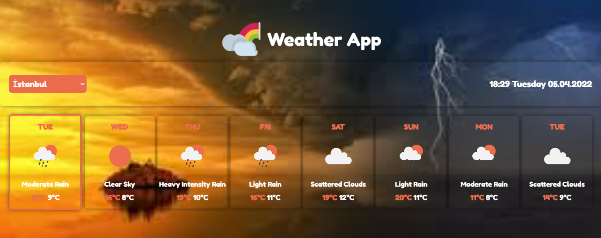
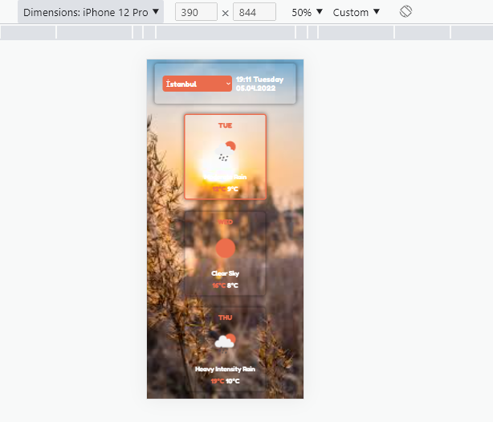

# React-WeatherApp
Patika.dev React modülü "Weather App" çalışması.

[https://reyhanyilmaz-react-weatherapp.netlify.app/](https://reyhanyilmaz-react-weatherapp.netlify.app/)

* ```Fetch API``` ile hava durumu bilgileri [www.openweathermap.org](https://openweathermap.org/) adresinden çekildi.
* Projede ```Context API ``` kullanıldı.
* Şehir bilgilerini içeren JSON dosyası: [Cities of JSON](https://gist.github.com/ozdemirburak) 



